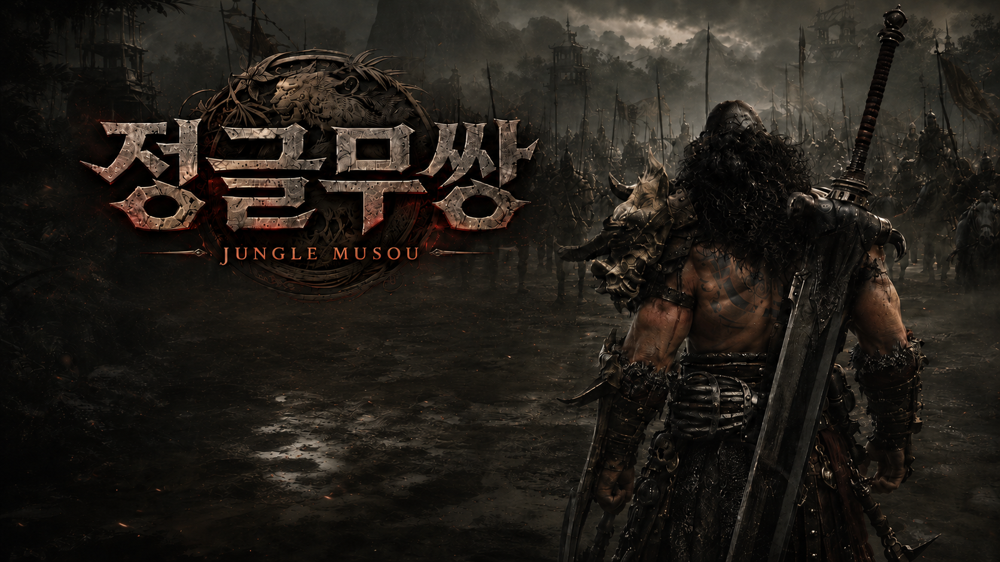

# 정글무쌍 (Jungle Musou)

> 직접 만든 C++ / DirectX 11 게임 엔진 위에서 **5일 만에** 만든 3D 핵앤슬래시 무쌍 액션 게임
>
> 크래프톤 정글 **Game Tech Lab 3기 · 14주차 게임잼** · 4인 팀 프로젝트

<p align="center">
  
</p>

---

## 🎬 시연 영상

<p align="center">
  <a href="https://youtu.be/-prBOp3srOc">
    
  </a>
</p>

<p align="center">
  <b>▶ <a href="https://youtu.be/-prBOp3srOc">유튜브에서 플레이 영상 보기</a></b><br>
  <sub>튜토리얼 → 군중 전투 → 중간보스 → 최종보스 → 아웃트로</sub>
</p>

---

## 프로젝트 개요

| 항목 | 내용 |
| --- | --- |
| **소속 / 기수** | 크래프톤 정글 Game Tech Lab 3기 |
| **주차** | 14주차 게임잼 |
| **기간** | 2026.06 · 5일 |
| **팀 규모** | 4인 |
| **장르** | 3D 핵앤슬래시 / 무쌍 액션 |
| **엔진** | 자체 제작 엔진 **KraftonEngine** (상용 엔진 미사용) |
| **언어 / 그래픽 API** | C++20 · Lua · HLSL / DirectX 11 |
| **플랫폼** | Windows (x64) |

이 저장소에는 **자체 제작 엔진과 게임 코드가 함께** 들어 있습니다.
엔진(`Source/Engine`, `Source/Editor`)은 정글 과정 동안 기수 전체가 단계적으로 만들어 온 결과물이고,
**14주차 게임잼 4인 팀의 산출물은 `Source/Game` 이하와 `Content/` 의 게임 데이터**입니다.
게임잼 기간 동안 게임을 만들면서 필요해진 엔진 기능(스켈레탈 GPU 인스턴싱, 애니메이션 Tick LOD,
카메라 셰이크/슬로모 노티파이, 검기·굴절 셰이더 등)도 함께 엔진에 추가했습니다.

---

## 게임 소개

수백 마리의 적이 몰려오는 전장에서 도끼를 든 바바리안이 되어 **군중을 쓸어버리고 보스를 처치**하는 무쌍 액션 게임입니다.

### 한 판의 흐름

```
Intro (타이틀 / 설정 / 스코어보드 / 조작 안내)
  └─ 튜토리얼 (12단계 조작 학습, 선택)
  └─ 전투 참가
       ├─ Play    : 아군 30 vs 적군 50 + 웨이브 소환(최대 100씩) — 군중 섬멸전
       │              └─ 성문 트리거 볼륨 진입 시 다음 구역으로 (점수·콤보·게이지 그대로 이월)
       └─ Play2   : 중간보스 Warrior 전 → 최종보스 Golem 조우 연출 → 최종 결전
                      ├─ 승리 → 결과 오버레이 + 스코어보드 저장 → 엔딩 크레딧
                      └─ 패배 → 사망 연출 + 재시작 / 그만두기
```

- **중간보스 Warrior** — HP 50% 도달 시 페이즈 2 컷씬(대사 + 파워업 + 림라이트 각성) 후 패턴 강화
- **최종보스 Golem** — 무너진 석상이 일어나는 등장 연출(지진 셰이크 + 시네마틱 카메라) → 근접·투척 패턴
- **점수** = 적중 시 `누적 점수 += 처치 수 × 현재 콤보` — 콤보를 끊지 않고 몰아칠수록 점수가 폭발
- **콤보 윈도우 3초** — 3초 안에 다시 때리지 못하면 콤보 리셋
- **결과 기록** — 승리 시 점수 / 처치 수 / 최대 콤보 / 클리어 타임 / 잔여 체력이 로컬 스코어보드(상위 12개)에 저장

---

## 조작

| 입력 | 동작 |
| --- | --- |
| `W A S D` / 방향키 | 이동 (카메라 기준) |
| 마우스 | 시점 회전 |
| 좌클릭 | 공격 — 3단 콤보 (진입 상황·이동 여부에 따라 모션 분기) |
| 우클릭 | 강공격 / **콤보 분기 피니셔** |
| `Space` | 점프 |
| `Shift` | 구르기 (전 구간 무적, 후딜 캔슬) |
| `R` | **무쌍기** (게이지 가득 찼을 때) |
| `X` | 발도 / 납도 |
| `ESC` / `P` | 일시정지 · 설정 |

**게임패드(XInput)** 를 지원합니다. 패드 입력을 가상 키로 주입하는 방식이라 게임 로직은 키보드와 동일한 경로를 탑니다.

| 패드 | 동작 |
| --- | --- |
| D-pad | 이동 |
| 우스틱 | 시점 회전 |
| `A` | 점프 / 메뉴 확인 |
| `X` / `Y` | 공격 / 강공격 |
| `B` | 구르기 |
| `RB` | 무쌍기 |
| `LB` | 발도 · 납도 |
| `Start` | 일시정지 |

<details>
<summary>디버그 치트 키</summary>

| 키 | 동작 |
| --- | --- |
| `F1` | 플레이어 즉사 |
| `F2` | 필드의 보스 전부 처치 |
| `F3` | 무적 토글 |
| `F4` | 체력 +100 |
| `F5` | 공격력 999999 토글 |

</details>

---

## 핵심 시스템

### 1. 데이터 주도 전투 — `attack_data.lua` / `boss_data.lua`

공격 판정·모션·연출을 **C++ 로직과 완전히 분리**해 Lua 테이블로 뺐습니다.
저장하면 **핫 리로드** 되어 다음 콤보부터 즉시 반영되므로, 게임잼 기간 내내 밸런싱과 모션 교체를
빌드 없이 반복할 수 있었습니다.

```lua
specs = {  -- 판정/밸런스
    light1 = { range = 3.5, height = 2.5, cone_deg = 140, dmg = 1.0, kb = 1.5, shake = 0.05 },
    branch2 = { range = 4.5, cone_deg = 360, dmg = 1.8, launch = 8.0, self_launch = 7.5 },  -- 런처
},
steps = { ... },   -- 몽타주/시퀀스 · 콤보 윈도우 · 카메라 연출 샷
chains = {         -- 흐름 구성 — id 참조라 재배열이 한 줄
    light = { idle = { {"ss_slash5","gs_slash"}, {...}, {...} },  -- 단계별 랜덤 변주 풀
              air_juggle = { "air_slash1", "air_slash2", "jump_heavy" } },
    branch = { "horizontal", "spin_low", "spin_high" },
    ultimate = { "ult_backflip", "ult_backhand" },
}
```

- 판정 스펙 / 스텝 / 체인의 3단 구조 — 모션 순서 변경이 **한 줄 수정**
- 단계별 **랜덤 변주 풀** (직전 모션 반복 회피는 C++ 처리) + 재생속도 랜덤화
- 시퀀스에 저작 노티파이가 없으면 데이터 기준으로 **런타임 자동 주입**

### 2. 플레이어 액션 — 콤보 · 공중 저글 · 무쌍기

- **컨텍스트 진입 공격** — 정지 / 이동 / 공중 중 어느 상태에서 들어갔는지에 따라 1단 모션이 달라지고 2단부터 합류
- **콤보 분기** — 좌클릭 체인 도중 우클릭으로 단수별 전용 피니셔(횡베기 / 로우 스핀 / 하이 스핀)로 분기
- **공중 저글** — 2단 분기(로우 스핀)가 적과 플레이어를 함께 띄우고, 착지 전까지 공중 3단 체인(행 타임을 위해 중력 0.25배)
- **무쌍기 (R)** — 적중 40회 누적으로 게이지 충전(보스 적중은 5배), 발동 시 전 구간 무적 + 슬로모 진입 →
  백플립 → 타겟 락온 백핸드 강타 → **전방으로 진행하는 충격파 검기 펄스** → 강착지 임팩트
- **몽타주 크로스페이드 / 루트 모션** — 콤보 전환 시 포즈·루트 모션 연속성 유지, 몽타주 중 이동·점프 잠금 +
  말미 구간에서 이동 입력으로 조기 캔슬(UE recovery cancel 패턴)
- **발도 / 납도** — 무기 상태별 로코모션 세트 전환, 모션 중간에 무기 본을 손↔등으로 스왑

### 3. 대규모 군중 시스템 — `Source/Game/Crowd`

수백 유닛을 동시에 굴리기 위해 액터가 아닌 **SoA(Structure of Arrays) 데이터 저장소**로 설계했습니다.

| 모듈 | 역할 |
| --- | --- |
| `CrowdUnitStore` | 유닛 상태 SoA 저장 + 핸들 기반 접근 |
| `CrowdSpatialPartition` | 공간 분할 — 근접 질의 가속 |
| `CrowdAIManager` | 상태 판단 (추적 / 교전 대기 / 공격 / 피격 / 사망) |
| `CrowdMovementManager` | 이동 · 분리(separation) · 밀집 떨림 완화 |
| `CrowdEngagementManager` | 플레이어 교전 슬롯 / 공격 토큰 — 동시 공격 수 제한 |
| `CrowdCombatManager` | 데미지 · 넉백 · 띄우기 적용 |
| `CrowdVisualPool` | 스켈레탈 비주얼 액터 풀링 + LOD별 애니메이션 갱신 주기 조절 |
| `CrowdGroundQuery` | 지형 표면 추종 (지면 높이 캐싱) |

- **거리 기반 LOD** — 애니메이션 갱신 주기 / 그림자 캐스팅 / 스키닝 행렬 업데이트 레이트를 단계적으로 낮춤
- **스켈레탈 메시 GPU 인스턴싱** — 같은 메시의 다수 유닛을 인스턴싱으로 묶어 드로우콜 절감 (불투명 / 반투명 / PreDepth 경로 전부)
- 플레이어 공격은 `GameMode` 의 **이벤트 허브**로 브로드캐스트되고, 군중 매니저가 자기 데이터에서 판정 → 히트 수를 회신

### 4. 보스 — 패턴 / 페이즈 / 컷씬을 전부 데이터로

`boss_data.lua` 하나로 보스의 스탯 · 등장 컷씬 · 페이즈 전환 · 패턴 · 사망 연출을 모두 기술합니다.
연출은 `{ type, time, ... }` 스텝 타임라인이라 컷씬 타이밍 조정이 데이터 수정만으로 끝납니다.

```lua
intro = {
    { type = "lock_player",   time = 0.0, value = true },
    { type = "blend_camera",  time = 0.0, duration = 0.35, offset = {10.5, 1.0, 2.0}, camera_tag = "WarriorBoss" },
    { type = "play_sound",    time = 1.0, sound = "Boss_Warrior/boss_warrior_intro_00.wav" },
    { type = "dialogue",      time = 1.0, text = "여기까지 오다니 제법이군." },
    { type = "camera_shake",  time = 5.0, scale = 2.0, shake = "Content/Particle/WarriorBossShake.uasset" },
    { type = "restore_camera",time = 7.0, duration = 0.25 },
}
```

지원 스텝: `lock_player` / `face_target` / `fade_in·out` / `blend_camera` / `restore_camera` /
`play_montage` / `play_sound` / `dialogue` / `camera_shake` / `warning_rim` / `set_invincible` /
`set_pattern_enabled` / `spawn_projectile` / `destroy_actor` …

- **패턴 선택** — 페이즈별 후보 중 거리(min/max range) · 쿨다운 · 가중치로 추첨, 사거리 밖이면 추격 상태로
- **최종보스 투척 조준** — 공격 노티파이 전까지 플레이어를 계속 조준(에임 턴 속도 제한)
- **경고 림라이트** — 공격 시작 시 보스 실루엣에 림라이트를 씌워 사전 텔레그래프

### 5. 타격감 연출

무쌍 게임의 핵심인 "때리는 맛"을 위해 연출 레이어를 노티파이 기반으로 쌓았습니다.

- `AnimNotify_MusouAttack` — 공격 판정 발행 (판정과 연출의 단일 진입점)
- `AnimNotifyState_ComboWindow` — 콤보 입력 접수 구간
- `AnimNotifyState_CameraShot` — **몽타주별 시네마틱 카메라 연출** (구간 · 오프셋 · FOV · 레터박스 · 앵커 모드)
- `AnimNotify_CameraShake` / `AnimNotify_Slomo` — 셰이크 · 슬로모 (슬로모는 *명중했을 때만* 발동 옵션)
- `AnimNotifyState_WeaponTrail` — 2레이어 무기 궤적
- `AnimNotify_PlaySlashEffect` — 검기 이펙트 (전용 셰이더 + **굴절 패스**)
- `AnimNotify_GroundSlamShockwave` / `UltimateLeap` / `UltimateAdvance` — 무쌍기 전용 연출 제어
- **킬 버스트** — 스윙 한 번에 2킬 이상 나오면 글로벌 슬로모(0.25배, 0.25초) + 강한 카메라 셰이크
- **히트 림라이트 플래시**, 히트 파티클, 히트스탑, 피격 시 블러드 비네트
- 카메라 연출 / 셰이크는 설정에서 **개별 ON·OFF** (멀미 대응)

### 6. UI · HUD — RmlUi

HTML/CSS 문법으로 UI를 작성할 수 있는 RmlUi 를 붙여 인트로 / HUD / 스코어보드 / 크레딧을 구성했습니다.

- **HUD** — 체력 바, 무쌍 게이지, 콤보(팝 이펙트), 처치 수(10단위 화면 중앙 연출), 점수, 보스 체력 바
- **인트로** — 컷신 이미지, 메뉴, 설정(BGM 볼륨 / 카메라 연출 / 카메라 셰이크), 조작 안내 패널, 스코어보드
- **스코어보드** — 승리 시 이름 입력 후 저장, 상위 12개 기록 페이지 넘김
- **엔딩 크레딧** — 실시간 전투 장면을 배경으로 시네마틱 카메라가 도는 아웃트로 (플레이어가 자동 전투)
- **키보드 / 게임패드 내비게이션** 공통 프리젠터로 통합 — 모든 오버레이를 마우스 없이 조작 가능
- 로딩 화면 · 페이드 전환 · 씬 간 매치 상태(점수/콤보/게이지) 보존

---

## 엔진 — KraftonEngine

게임잼의 토대가 된 자체 제작 엔진입니다. (정글 과정 동안 기수 전체가 단계적으로 구축)

```
언리얼 엔진의 구조를 참고한 C++ 게임 엔진 + 에디터
```

| 영역 | 내용 |
| --- | --- |
| **오브젝트** | `UObject` 계층 · 리플렉션(`UPROPERTY` 매크로 + 헤더 생성기) · GC · 직렬화 |
| **게임프레임워크** | `AActor` / `APawn` / `ACharacter` / `AGameMode` / `AGameState` / `APlayerController` / `UActorComponent` |
| **렌더링** | DirectX 11 · 패스 기반 렌더러 · 클러스터드/타일 라이트 컬링 · CSM/VSM 그림자 · Hi-Z 오클루전 컬링 |
| **포스트 프로세스** | Bloom · DOF · FXAA · Height Fog · Vignette · Letterbox · Camera Fade · Outline |
| **애니메이션** | 스켈레탈 메시 · 스키닝 · 애님 그래프(상태 머신 / 슬롯 / 레이어드 본 블렌드) · 몽타주 · 애님 노티파이 · 루트 모션 · **Tick LOD** · **GPU 인스턴싱** |
| **물리** | NVIDIA PhysX 통합 · 피직스 애셋 에디터 · 래그돌 · NvCloth |
| **스크립팅** | Lua (sol2) 바인딩 — 애님 인스턴스 / 액터 스크립트 / 데이터 테이블, 바인딩 자동 생성기 |
| **에디터** | ImGui 기반 · 씬 아웃라이너 / 디테일 패널 / 콘텐츠 브라우저 / 머티리얼·파티클·피직스 애셋 에디터 / PIE |
| **UI** | RmlUi (HTML/CSS 계열) + 비트맵 폰트 |
| **오디오** | FMOD |
| **애셋** | FBX SDK 임포트 → 자체 `.uasset` 포맷 직렬화 |

**서드파티**: PhysX · NvCloth · FMOD · RmlUi · ImGui · Lua/sol2 · FBX SDK · DirectXTK · stb_image · SimpleJSON

---

## 팀 & 역할

**Game Tech Lab 3기 · 14주차 게임잼 2팀** (4인)

| 이름 | 담당 |
| --- | --- |
| **국동진** | 엔진 렌더링 · 최적화 (스켈레탈 GPU 인스턴싱, 애니메이션 Tick LOD, 콜리전 최적화) / VFX (검기·굴절 셰이더, 무기 트레일, 히트 파티클, 히트 림라이트) / 오디오 / 중간보스 패턴 · 페이즈 2 · 시네마틱 카메라 |
| **심우진** | 플레이어 전투 전반 — 콤보 체인 · 분기 · 공중 저글 · 무쌍기 · 구르기 · 발도납도 / 데이터 주도 공격 시스템(`attack_data.lua`) / 몽타주·루트모션·크로스페이드 / 카메라 샷 · 셰이크 · 슬로모 노티파이 / 본 부착 무기 / 튜토리얼 씬 / 엔딩 크레딧 아웃트로 / 게임패드 지원 |
| **박세영** | UI · UX 전반 — 인트로 · HUD · 스코어보드 · 로딩 · 크레딧(RmlUi) / 점수 시스템 / 승리·사망 오버레이 / 보스 체력 바 / 다이얼로그 · 컷신 UI / BGM · 오디오 설정 / 메뉴 내비게이션 |
| **강명호** | 대규모 군중 시스템 전반 (유닛 저장소 · AI · 이동 · 교전 · 공간 분할 · 비주얼 풀 · 지면 추종 · LOD) / Lua 유닛 스포너 / 최종보스 조우 연출 · 패턴 · 투척 조준 |

---

## 빌드 & 실행

### 요구 사항

- Windows 10/11 x64
- Visual Studio 2022 (C++ 데스크톱 개발 워크로드)
- Windows SDK · DirectX 11 지원 GPU

### 에디터 실행

```bat
:: 1. 프로젝트 파일 생성 (소스 목록 · 리플렉션 헤더 · Lua 바인딩 자동 생성)
GenerateProjectFiles.bat

:: 2. KraftonEngine.sln 을 Visual Studio 로 열고 Debug|x64 또는 Release|x64 빌드 후 실행
```

### 게임 빌드 (에디터 없는 실행 파일)

```bat
GameBuild.bat
```

빌드가 끝나면 `GameBuild/` 폴더가 생성됩니다.

```
GameBuild/
  Play.bat                 ← 더블클릭으로 게임 실행
  Bin/  KraftonEngine.exe + *.dll
  Shaders/  Content/  Settings/
```

> 시작 씬과 게임모드는 `KraftonEngine/Settings/ProjectSettings.ini` 의
> `Game.StartLevelName` / `Game.GameModeClassName` 으로 지정됩니다. (기본값: `Intro` / `AMusouGameMode`)

---

## 저장소 구조

```
Jungle_Week14_Team2/
├── KraftonEngine/
│   ├── Source/
│   │   ├── Engine/          # 엔진 런타임 (렌더/애니메이션/물리/오디오/Lua/UI …)
│   │   ├── Editor/          # ImGui 기반 에디터 (아웃라이너 · 디테일 · 애셋 에디터 · PIE)
│   │   └── Game/            # ★ 게임잼 산출물
│   │       ├── Musou/       #   플레이어 · 전투 · 보스 · 게임모드 · UI 프리젠터 · 스코어보드
│   │       ├── Crowd/       #   대규모 군중 시스템
│   │       └── Lua/         #   게임 전용 Lua 바인딩
│   ├── Content/
│   │   ├── Script/Data/     # ★ attack_data.lua · boss_data.lua (전투/보스 데이터)
│   │   ├── Scene/           # ★ Intro · Tutorial · Play · Play2 · Credits
│   │   ├── UI/              # ★ RmlUi 문서 (Intro / InGameHUD / Credits / Tutorial / Loading)
│   │   ├── Montages/ Data/ Particle/ Material/ Texture/ Audio/ Font/
│   ├── Shaders/             # HLSL (Geometry / Lighting / PostProcess / UI)
│   ├── ThirdParty/          # PhysX · NvCloth · FMOD · RmlUi · ImGui · Lua/sol2 · FBX SDK
│   └── Settings/            # ProjectSettings.ini · Editor.ini
├── Scripts/                 # 프로젝트 생성 · 리플렉션 헤더 생성 · Lua 바인딩 생성 (Python)
├── Docs/                    # 기술 문서 (FBX 임포트/스키닝 디버그, 프로퍼티 리플렉션)
├── GenerateProjectFiles.bat
└── GameBuild.bat
```

---

## 스크린샷

> *(추가 예정 — `Docs/img/` 에 이미지를 넣고 아래 주석을 해제해 주세요)*

<!--
| 군중 전투 | 콤보 · 공중 저글 |
| --- | --- |
|  |  |
| **무쌍기** | **최종보스 Golem** |
|  |  |
-->

---

## 사용 애셋

캐릭터 · 애니메이션은 [Mixamo](https://www.mixamo.com/) 무료 애셋을 사용했으며,
그 외 맵 · 이펙트 · 사운드 애셋은 각 출처의 라이선스를 따릅니다.
